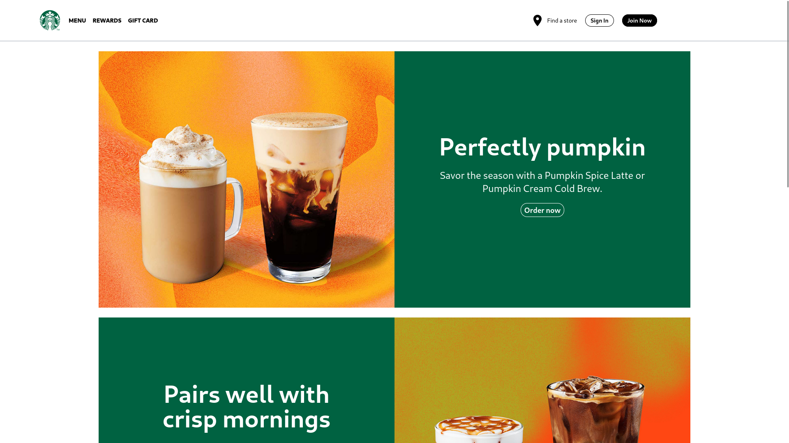

# Starbucks web clone

[](https://fresh.deno.dev)


This is a clone of the main page of the starbucks webpage, I have done this in
order to practise my CSS and HTML skills.

This project have been done using Deno and Fresh. In order to run the project
execute the following command:

```
deno task start
```

Here is a screenshot of the webpage:



Made by Mario with ❤️